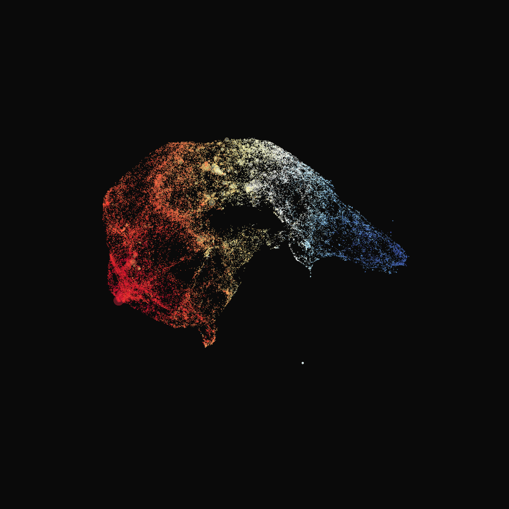
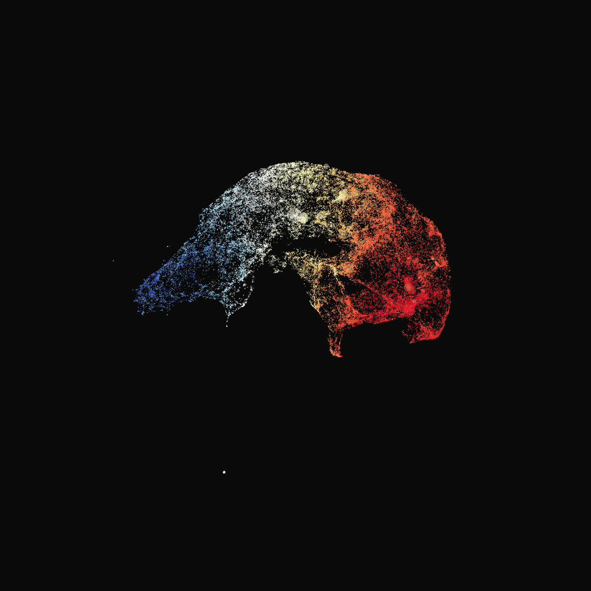

# *Look on Chosun-Population and Social Mobility Project*

*What's this?*

*A social structure.*

▶️ [Go to the Dynamic View](https://acheul.github.io/chosunpop-look)

 
<i>Chosun dynasty(Korea, 15th~19th Century)</i> produced triennial population census data, called *HoJeokDaeJang*. Today only parts of the original data remain, still considerable is the amount. This historical big data - easily covering more than 200 years and 2 million population size of a certain region - has triggered interesting studies of demography and social sciences.

This project, ***ChosunPop***, seeks to take a leap to dive into the data with more powerful methodological tools and statistical frameworks. Let's say, HOW to quantitatively estimates social status of individuals from the raw records which have qualitative formats? HOW to conduct a statistical analysis on this massive but messy data that left behind history?

These methodological HOW questions directly link to some theoretically important questions of modern days social science. HOW to describe and categorize shapes of social stratification and social mobility? HOW mobility engages in inequality and vice versa? WHAT is the long-term dynamics of the social mobility and social inequality? Modern day researchers are still waiting for long-term and abundant dataset to answer these questsion. Here is *HoJeokDaeJang*, remains of Korean ancien regime, which is long-term and informatically abundant - but still messy and intricate to handle.

The ChosunPop project struggles to handle it. Via Machine Learning and Bayesian framworks. ML helps to quantitatate qualitative formated data: i.e., creating social status score from raw records. ML(DL) also helps to build models to investigate longitudinal connection between individuals and households. Connecting records longitudinally (for example, connects 1810's records *Kim* and 1819's records *Kim*) enables new research surfers: we can check inter-generational social/spatial mobility - over super-long-term period!

Bayesian frameworks help to handle the data which is incomplete and messy in its nature comparison to modern day survey data. Analyses and inferences on the data demand a series of subjective assumptions: which are expected to be explicitly combined with the statistical model, not implicitly. The bayesian hierarchical modeling enables to handle it.

At this moment, this project produces one organized [paper](https://snu-primo.hosted.exlibrisgroup.com/permalink/f/1fgjt92/82SNU_INST51868062750002591) (not in journal, but a dissertation). The future schedule of development is not tightly planned for now, but the proposed combination of the data and methodological approaches of this project is ready to trigger further development around the fields.

This repository mainly covers look-able assets from the studies, rather than codes used to produce the assets.

## Summary of current works

* **Data: *HoJeokDaeJang* of Taeku and Tansung**

  *Accumulative counts of remaining records*

  ||*Taeku*|*Tansung*|
  |--|--|--|
  |Years|61sets(1686~1876)|33sets(1606~1888)|
  |Households[戶]|32,6298|52,277|
  |Personnels[口]|1,757,934|276,657|
  |Myun[面]|837|134|

* **Processing(1): Match individuals through the longitudinal records.**
  * Develop a customized DL model, which applies NLP models like BERT, to determine if a pair of personnels from the raw data set is identical case or not. Collect the model's inference result and use it for main analysis.
  * Result of the matching process: more than about 70% of the total personnels on the records are accounted for the longitudinal matching cases.

    | |*Taeku*| |*Tansung*| |
    |--|--|--|--|--|
    | |Total|M-F|Total|M-F|
    |Total Personnels| 1,757,934| 589,082| 276,657| 88,210|
    |Identical Pairs| 1,224,687| 453,625| 188,734| 62,496|
    |(Ratio to Total)|  (70%)| (77%)| (68%)| (71%)|
    |Identical Personnels|  413,369| 145,170| 63,764| 21,033|
    |(Ratio to Total)|  (34%)| (32%)| (34%)| (34%)|

    &nbsp;&nbsp; *(*M-F: male and family-member)*

* **Processing(2): Generate Socio-rank score**
  * I built the ***Job2Vec*** model to quantitate social ranks. The raw data has natural-language formated record on each individuals social status - which is called *JikYuk(職役)* from the historical context. The number of unique values of *JikYuk* is more than 49,000. Simple **Word2Vec** is not a good tool to use here, as the record has at least more than 2 levels semantic hierarchy.
  * **Job2Vec** conducts 2 level computation. First, it computes a representation of a sequence of Chinese characters consising of a value of *JikYuk*. The backbone of this first level sub-model is Transformer(Vaswani et al. 2017). Next, the second sub-model receives the result of first model - a pair of two values - then conducts the general word2vec computation. This 2-level Word2Vec, or Job2Vec, effeciently represents semantic distances and positions of the *JikYuk*s.
  * Results of Job2Vec are not directly used for Socio-Rank Score. The results go through a series of statistical processes: gradating overall distribution over time; changing the raw scores into rank scores over time. Logit transformation and hierarchical regression model were used.

* **Measurement: Index of Inequality, Segregation and Social Mobility**
  * Results from the previous works of processing the data are now turned into more general measurment indices for social inequality, segregation, and social mobility over areas over time.
  * **Inequality index** is the Gini index. It's measured from socio-rank score.
  * **Segregation index** is [Reardon](https://cepa.stanford.edu/sites/default/files/reardon%20&%20bischoff%20income%20inequality%20segregation%20AJS%20final.pdf)'s Rank-Order Information Theory Index. It uses socio-rank score.
  * **Social mobility index** is based on the Rank-Rank model of [Chetty et al. 2014](https://www.nber.org/system/files/working_papers/w19843/w19843.pdf). The measurement of inter-generational mobility index was enabled from the longitudinal matching process, which was enabled by Deep Learning.
  * A bayesian hierarchical model was used to gradate distribution of indices over small-level areas(*Li[里]*).
    * *OLS vs. BHM* 
    * 

## Featured Looks(1): Modeling

  * **Matching Model**
    * 

  * **Job2Vec**: 2-level Word2Vec with Transformers
    * 

    * *Job2Vec vs. Word2Vec  (left vs. rights)*
      * 

## Featured Looks(2): Measurements
 
  * **Taeku in 18th~19th Century**
  * 

   

  * **Inequality, Segregation, and Mobility Indices over Myun[面]**
  * 

   

  * **Dynamics of Inequality, Segregation, and Mobility over time**
  * 

   

  * **Shapes of Social Stratification of 18th~19th Century in Korea**
    * [Dynamic View](https://acheul.github.io/chosunpop-look)  
  * * *The higher is the social status of a *JikYuk* the blue is its dot, the lower the red.*
  * 

  * **Distribution of processed socio-rank scores over areas over time**  
  * 

   

  * **Where was the land of opportunity? - Geography of upward mobility over area over time**
  * 

